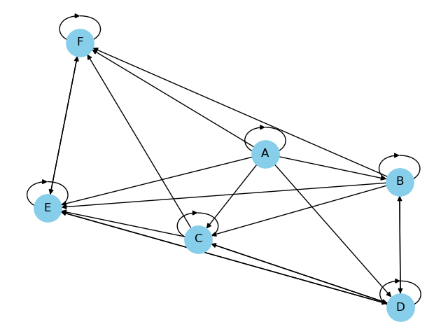

## Binary Relations Analysis

This program provides utility functions to analyze and visualize binary relations. It supports reading binary relations from `.xls`, `.xlsx`, and `.csv` files. The program offers the following features:

1. **Visualization**: Displays the binary relation as a graph.
2. **Property Checks**: Checks for various properties such as completeness, reflexivity, symmetry, etc.
3. **Transformation**: Displays strict and indifference relations derived from the original relation.
4. **Topological Analysis**: Shows a topological sorting if the relation is acyclic.

### Libraries Used

```python
import numpy as np
import pandas as pd
import networkx as nx
import matplotlib.pyplot as plt
```

### Utility Functions

- `read_xls(file)`: Reads a `.xls` or `.xlsx` file and returns a numpy array.
- `read_csv(file)`: Reads a `.csv` file and returns a numpy array.
- `VisualizeBinaryRelation(matrix)`: Visualizes a binary relation as a graph with nodes named starting from A.
- Property check functions:
  - `CompleteCheck(matrix)`
  - `ReflexiveCheck(matrix)`
  - `AssymetricCheck(matrix)`
  - `SymmetricCheck(matrix)`
  - `AntisymmetricCheck(matrix)`
  - `TransitiveCheck(matrix)`
  - `NegativetransitiveCheck(matrix)`
  - `CompleteOrderCheck(matrix)`
  - `CompletePreOrderCheck(matrix)`
- `StrictRelation(matrix)`: Returns the asymmetric part of the binary relation.
- `IndifferenceRelation(matrix)`: Returns the symmetric part of the binary relation.
- `has_cycle(matrix)`: Checks if the binary relation has a cycle.
- `Topologicalsorting(matrix)`: Returns the topological sorting of the binary relation.
- `TopologicalToMatrix(topo)`: Converts a topological sorting to a binary relation.
- `VisualizeTopologicalSorting(matrix)`: Shows the topological sorting as a graph.
- `VisualizeTopologicalSorting_linear(matrix)`: Shows the topological sorting as a graph with a linear layout.

### Main Program

The main program prompts the user to input the filename containing the binary relation. It then provides an interactive menu to choose from the aforementioned features. The user can visualize the binary relation, check its properties, view its transformations, or see its topological sorting.

### Usage Example

After running the program, you'll be prompted to enter the filename of your data. If you don't enter anything, the default filename `data.xlsx` will be used. The program will then display the following menu:

```
1. Visualize the binary relation
2. Check if the binary relation is complete
...
13. Show the topological sorting
14. Read another file
0. Exit
```

You can enter the number corresponding to the feature you want to use. For example, if you want to visualize the binary relation, enter `1`. If you want to exit the program, enter `0`.

For example, take the binary relation:

```
     A   B	 C	 D	 E	 F
A    1	 1	 1	 1	 1	 1
B    0	 1	 1	 1	 1	 1
C    0	 0	 1	 1	 1	 1
D    0	 1	 1	 1	 1	 0
E    0	 0	 0	 1	 1	 1
F    0	 0	 0	 0	 1	 1
```

The program will display the following graph:



When an operation is performed, the program will display the result and it will return to the main menu as soon as you press enter. For example, if you choose to check if the binary relation is complete, the program will display the following:

```
Executing action 2 ...
The binary relation is not complete.
Action 2 executed successfully.
Press enter to continue ...
```