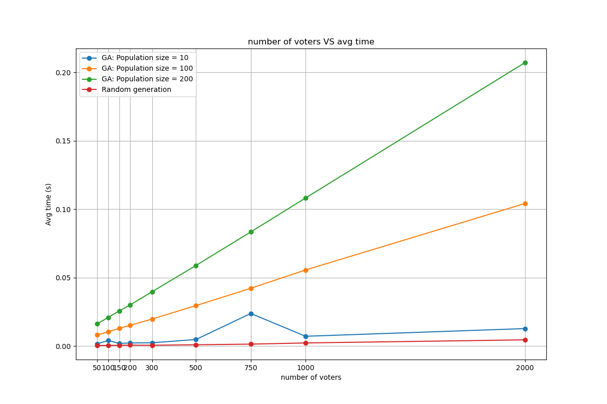
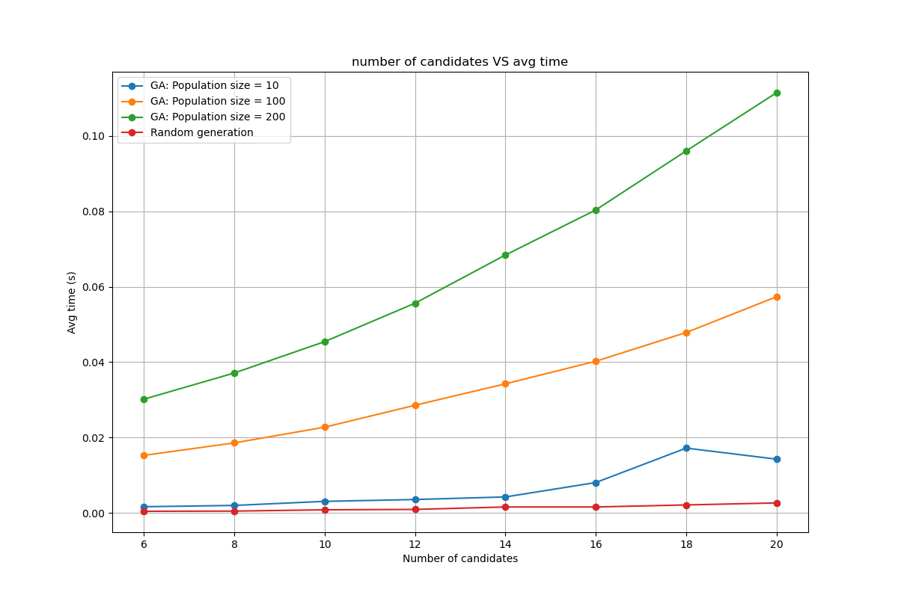
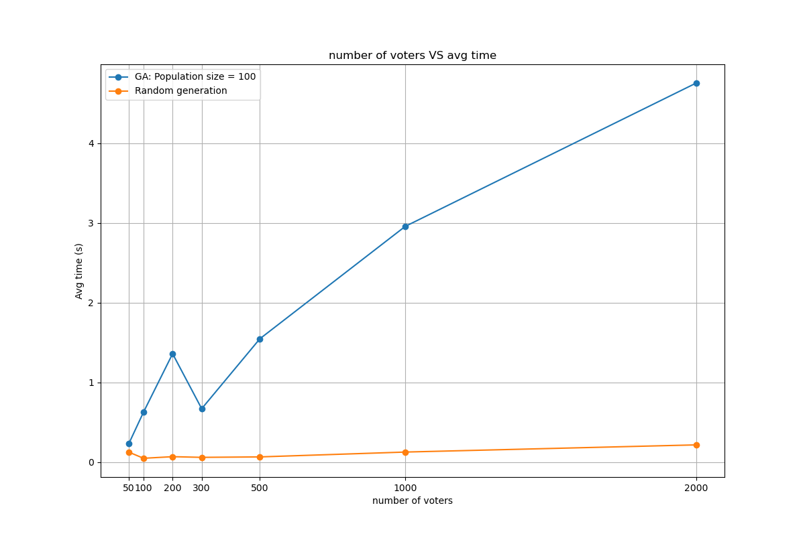
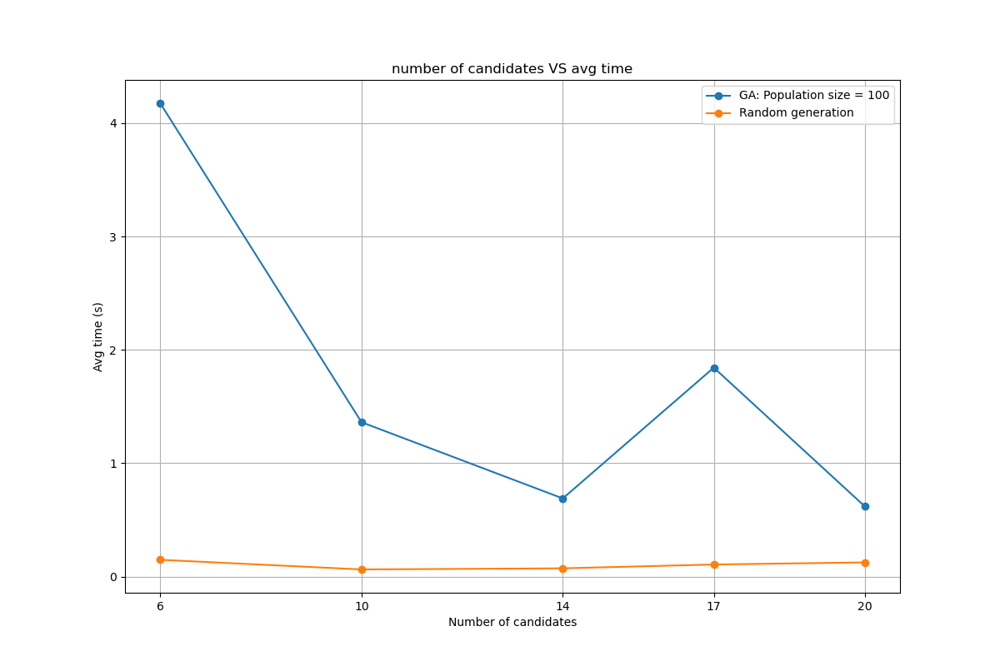

## Voting Rules in Python

In this practical, I have implemented the following voting rules in Python:
- Plurality
- Plurality with runoff
- Condorcet
- Borda

In addition, I have implemented functions to generate sets of profiles in which a) a candidate wins under all voting rules, and b) each voting rule has a different winner.

### Implementation of the generated profiles

a) _A candidate wins under all voting rules_:

For this task, I have programmed three different approaches:

- **Totally random**: I generate random profiles until I find one in which a candidate wins under all voting rules and fulfill the other requirements. To select a random set of profiles with n voters and m candidates, I do the following:

1. First, I generate a random profile, as an ordered list of the m candidates. The order is randomized.
2. Then for each voter:
            
a) With probability $\frac{thres}{\min\{20,n\}},$ I generate a new profile.

b) Otherwise, I add another vote to the previous profile.

3. Finally, I check if the profile fulfills the requirements. If not, I repeat the process.

- **Genetic algorithm**: I have implemented a genetic algorithm to generate profiles that fulfill the requirements. The algorithm is as follows:

    1. Generate the initial population of elections randomly.
    2. Evaluate the fitness of each election: $$fitness = 3\cdot full_{win} + 2\cdot req_1 + req_2,$$
    where $full_{win} is 1 if a candidate wins under all voting rules, and 0 otherwise; $req_1$ is 1 if no more than 90% of the voters have the same preference, and 0 otherwise; and $req_2$ is 1 if there is no candidate with more than 70% of the votes, and 0 otherwise.
    3. Repeat until the population has converged, i.e., $fitness=6$ for some election:
        1. Select the best elections by roulette wheel selection.
        2. Generate new elections by crossover and mutation.
            2.1. Select two elections using roulette wheel selection.
            2.2. Generate a new election by crossover: to combine two parents, we merge the profiles of the parents, we sort them by the number of votes, and we take the candidates in order until we have a new election.
            2.3. Mutate the new elections: we take the least common profile, remove it from the new election and add the votes to the most common profile.
        3. Evaluate the fitness of each election.

- **Leveraging the theorem (see below)**: using the theorem proved below, we can generate profiles in which we can make our preferred candidate win under all voting rules.

b) _Each voting rule has a different winner_:

A similar approach has been followed for this task. The only difference is that the fitness function is different:
$$fitness = 4\cdot n_{winners} + 2\cdot req_1 + 2\cdot req_2,$$
where $n_{winners}$ is the number of candidates that win under all voting rules.

### Comparison of the two approaches

One would expect the genetic algorithm to be much faster than the completely random approach. However, this is not the case. The reason is that it is apparently quite common to find profiles that fulfill the requirements, so the added complexity of the genetic algorithm is not worth it. In fact, the genetic algorithm is slower than the random approach in most cases.

For instance, in the following graph we can see the time it takes to generate an election example in which a candidate wins under all voting rules, as a function of the number of voters. The red line corresponds to the random approach, and the rest to the genetic algorithm for different population sizes.



We can observe that the GA is slower than the random approach for all population sizes. In fact, we observe how the difference is bigger for bigger population sizes.

The reason is that usually takes very few tries to find an election example fulfilling all requirements. However, we see how for small population size 10, the GA performs almost as fast as the random approach.

In the following graph, we can get similar conclusions, by plotting the time as a function of the number of candidates.



And the results are even worse for the case in which each voting rule has a different winner. In the following graphs, we can see this. Maybe there is a better way to perform the crossover and mutation, but I have not found it.




### Exercise 6: The election examples

Elaborate an election example with $n\ge40$ and $m\ge6$ where the winner is the same for the four voting rules Plurality, Plurality with runoff, Condorcet Principle and Borda Rule.

First of all, notice that there is a very easy way to do this:

**Theorem:** If there are only two profiles and there is a candidate with more than 50% of the votes, then this candidate wins under all voting rules, except maybe Borda.
If the candidate with more than 50% of the votes is in second place in the other profile, then this candidate wins under Borda too.

**Proof**
- Plurality: The candidate with more than 50% of the votes wins.
- Plurality with runoff: The candidate with more than 50% of the votes wins.
- Condorcet: If there is a candidate with more than 50% of the votes, it is the Condorcet winner.
- Borda: 
    Say there are $n$ voters, and the candidate with more than 50% of the votes has $k$ votes. Then, the candidate with more than 50% of the votes has $$p(A)=k\cdot n + (n-k)\cdot (n-1)$$ points. The second candidate has at most $$p(B)=k\cdot (n-1) + (n-k)\cdot n$$ points. 
    
    We have to address whether $p(A)>p(B)$ or $p(A)<p(B)$.

    $$\begin{align*}
    p(A)>p(B) &\iff k\cdot n + (n-k)\cdot (n-1) > k\cdot (n-1) + (n-k)\cdot n \\
    &\iff k > n-k,
    \end{align*}$$

    which is true, because $k>n/2$, so $2k>n$ and $k>n-k$.

This is probably not the most interesting way to do it, but you can try it by running the program `p3.py` and selecting option 7. You will obtain something like this:

```
Enter the number of voters(default: 40): 
Enter the number of candidates(default: 6): 
Generating the profile...
There are 21 with profile a>b>c>d>e>f
There are 19 with profile b>a>c>d>e>f
The winner is a .
```

For this, we can execute the program `p3.py` and select option 8. We enter $n$ and $m$, and the program will generate an election example fulfilling the requirements. One example is the following:

```
Enter the number of voters(default: 40): 
Enter the number of candidates(default: 6): 
Generating the profile...
        There are 4 with profile d>c>b>e>f>a
        There are 22 with profile b>d>c>f>e>a
        There are 14 with profile c>b>e>a>f>d
The winner is b .
It took 1 tries to generate the profile.
```

Or we can select option 10, to generate it using the genetic algorithm. In this case, we obtain the following:

```
Enter the number of voters(default: 40): 
Enter the number of candidates(default: 6): 
Generating the profile...
        There are 18 with profile c>d>f>b>e>a
        There are 22 with profile e>a>f>b>c>d
The winner is e .
It took 100 tries to generate the profile.
```

### Exercise 7: The election examples

Elaborate an election example with $n\ge40$ and $m\ge6$ where the winner is different for the four voting rules Plurality, Plurality with runoff, Condorcet Principle and Borda Rule.

For this, we can execute the program `p3.py` and select option 9. We enter $n$ and $m$, and the program will generate an election example fulfilling the requirements. One example is the following:

```
Enter the number of voters(default: 40): 
Enter the number of candidates(default: 6): 
Generating the profile...
        There are 16 with profile d>a>e>f>b>c
        There are 6 with profile f>b>a>e>c>d
        There are 10 with profile f>c>e>a>d>b
        There are 8 with profile e>c>b>a>f>d
The winner is d according to the plurality rule.
The winner is f according to the plurality runoff rule.
The winner is a according to the Condorcet voting rule.
The winner is e according to the Borda voting rule.
It took 1174 tries to generate the profile.
```

Or we can select option 11, to generate it using the genetic algorithm. In this case, we obtain the following:

```
Enter the number of voters(default: 40): 
Enter the number of candidates(default: 6): 
Generating the profile...
        There are 19 with profile f>e>c>a>b>d
        There are 12 with profile b>a>e>d>f>c
        There are 9 with profile d>a>e>b>f>c
The winner is f according to the plurality rule.
The winner is b according to the plurality runoff rule.
The winner is a according to the Condorcet voting rule.
The winner is e according to the Borda voting rule.
It took 100 tries to generate the profile.
```
